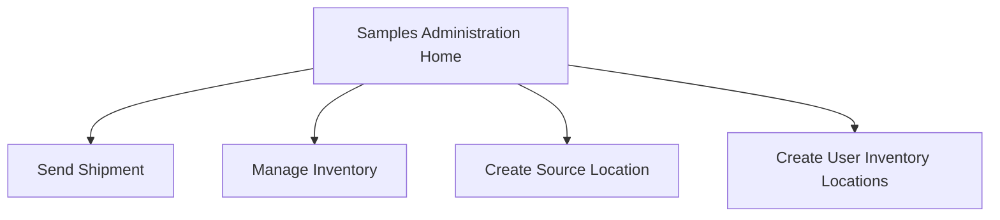
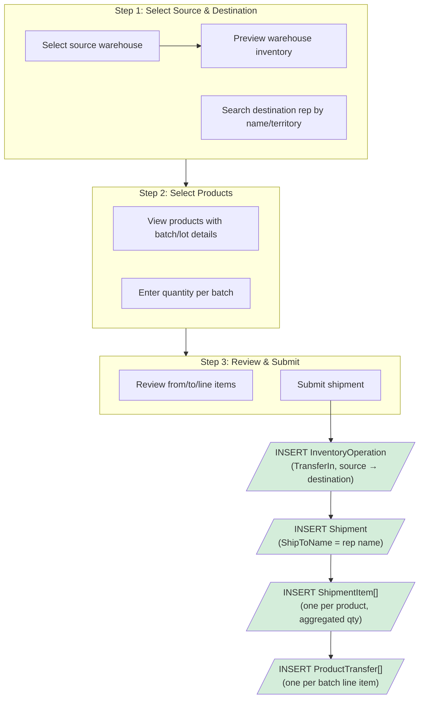
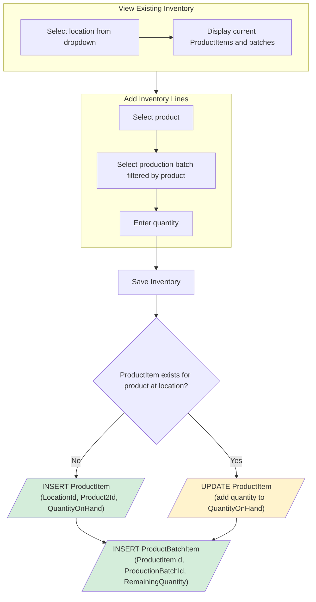
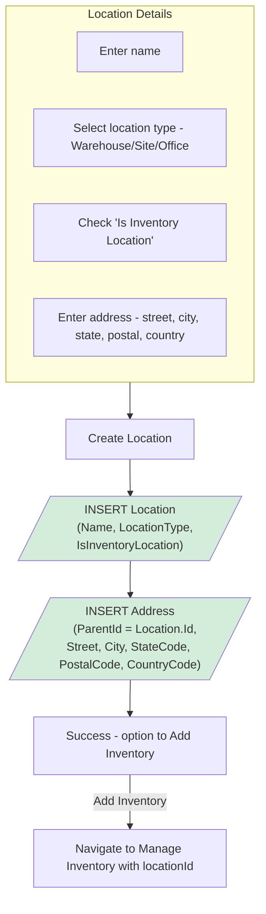
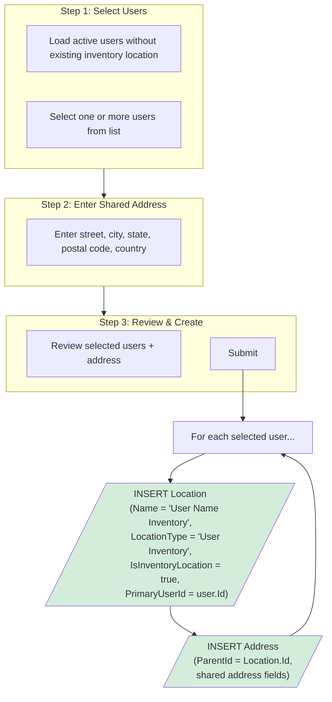
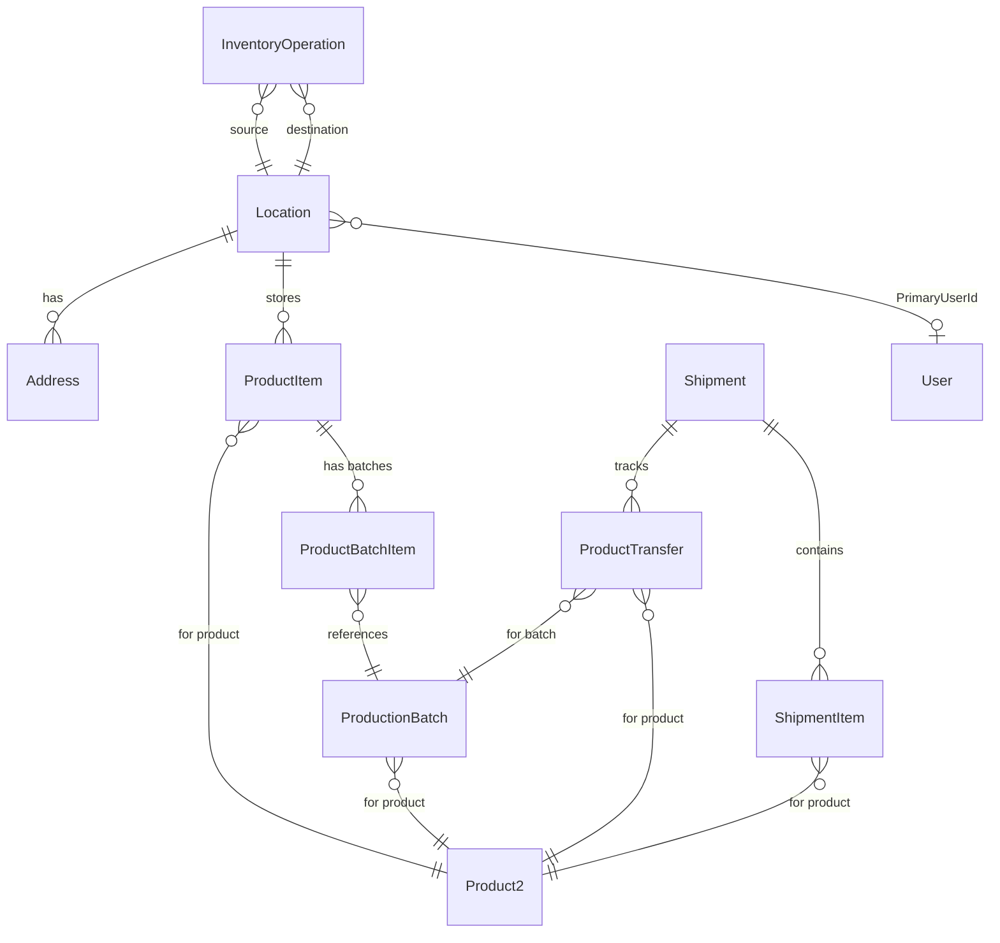

# Samples Admin App - Feature Flows

This document describes the user flows for each feature in the Samples Admin App, including which Salesforce objects are written to at each step.

---

## Home Navigation

---

## 1. Send Shipment

Ship samples from a warehouse to a rep's inventory location.

### Objects Written

| Object | Operation | Description |
|--------|-----------|-------------|
| `InventoryOperation` | INSERT | Transfer record linking source warehouse to destination rep location |
| `Shipment` | INSERT | Shipment header with `ShipToName` |
| `ShipmentItem` | INSERT | One per product (quantities aggregated across batches) |
| `ProductTransfer` | INSERT | One per batch line item with `QuantitySent`, `ProductionBatchId` |

---

## 2. Manage Inventory

View and add inventory (products + batches) at any inventory location.

### Objects Written

| Object | Operation | Description |
|--------|-----------|-------------|
| `ProductItem` | INSERT or UPDATE | Creates new product inventory record at location, or updates `QuantityOnHand` if one already exists |
| `ProductBatchItem` | INSERT | Links a `ProductionBatch` to the `ProductItem` with `RemainingQuantity` |

---

## 3. Create Source Location

Create a warehouse, site, or office location for storing samples inventory.

### Objects Written

| Object | Operation | Description |
|--------|-----------|-------------|
| `Location` | INSERT | The warehouse/site/office record with `LocationType` and `IsInventoryLocation = true` |
| `Address` | INSERT | Physical address linked to the location via `ParentId` |

---

## 4. Create User Inventory Locations

Mass-create inventory locations for multiple reps at a shared address.

### Objects Written (per user)

| Object | Operation | Description |
|--------|-----------|-------------|
| `Location` | INSERT | User Inventory location with `PrimaryUserId` linking it to the rep |
| `Address` | INSERT | Shared address record for the rep's inventory location |

---

## Data Model Reference

